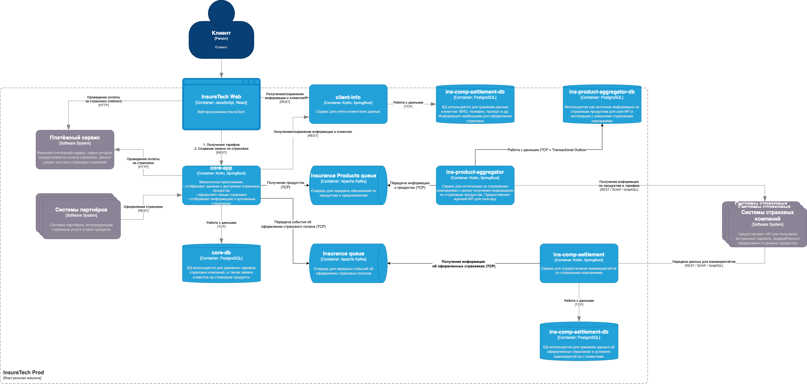

# Задание 3. Переход на Event-Driven архитектуру
## Текущие проблемы
1. Задержки и ошибки при взаимодействии с API страховых компаний
   - Агрегация данных из пяти (а вскоре десяти) страховых компаний в рамках одного REST-запроса может приводить к тайм-аутам и нестабильности.
2. Сложность масштабирования
   - С увеличением числа страховых компаний нагрузка на сервис ins-product-aggregator возрастет, а текущий подход с синхронными запросами не масштабируется.
3. Низкая консистентность данных
   - Данные о продуктах обновляются в сервисе core-app только раз в 15 минут, а в ins-comp-settlement — раз в сутки. Это приводит к ситуации, когда пользователи работают с устаревшей информацией.
4. Сложность обслуживания
   - Взаимозависимость между сервисами core-app, ins-comp-settlement и ins-product-aggregator через REST увеличивает вероятность отказов из-за ошибок в одном из них.
5. Ограниченная возможность обработки больших объемов данных
   - Разовый запрос на сбор и обработку данных от десяти страховых компаний может быть слишком тяжелым, что приведет к падению производительности.
## Риски с ростом нагрузки
1. Увеличение времени ответа
   - С ростом числа страховых компаний время выполнения синхронных запросов значительно увеличится.
2. Снижение отказоустойчивости
   - Один сбой в цепочке запросов приведет к недоступности данных для сервисов, зависящих от ins-product-aggregator.
3. Невозможность быстрого масштабирования
   - REST-взаимодействие усложняет горизонтальное масштабирование системы.

## Предложения по изменению архитектуры
Измененная архитектура представлена на листе "Exc3 - Updated InsureTech"

## Обновленное решение с Event-Driven архитектурой
1. Переход на Event-Streaming между сервисами
   - ins-product-aggregator публикует обновления данных о продуктах в виде событий в Kafka-топик products-updates.
   - core-app подписываются на этот топик, чтобы получать актуальные данные в реальном времени.
2. Использование паттерна Transactional Outbox
   - ins-product-aggregator записывает изменения в базу данных, а затем публикует события об изменениях через Transactional Outbox, гарантируя целостность данных.
3. Асинхронная обработка данных
   - ins-comp-settlement теперь использует события из Kafka вместо ежедневного REST-запроса к core-app.