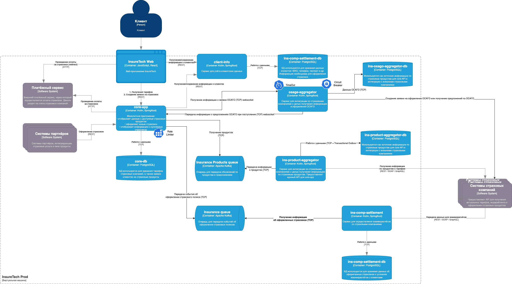
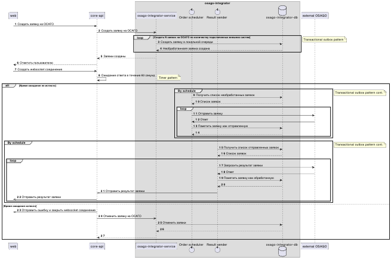

# Задание 4. Проектирование продажи ОСАГО
## Ограничения и предположения

## Предложения по изменению архитектуры

### osago-aggregator
1. Реализовать взаимодействие core-app с osago-aggregator с использованием синхронного подхода
3. При реализации работы с osago-aggregator на стороне core-app для ограничения нагрузки osago-aggregator использовать паттерн Rate Limiter
4. Для повышения отказоустойчивости и повышения производительности при взаимодействии osago-aggregator и внешними системами использовать паттерн Circuit Braker
5. Общая схема работы osago-aggregator приведена на sequence диаграмме 

core-app -> osago-aggregator (REST API, через Kafka/RabbitMQ для асинхронных уведомлений).
osago-aggregator -> страховые компании (API для создания заявок и получения предложений).
В схеме нужно будет учесть применение паттернов отказоустойчивости:
для взаимодействия с страховыми компаниями: Timeout, Retry, Circuit Breaker.
для взаимодействия с core-app: Rate Limiting, Circuit Breaker.